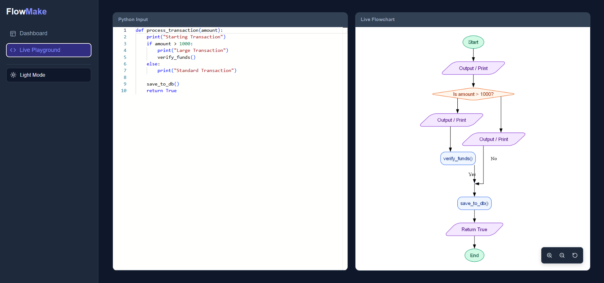

# FlowMake - Python to Flowchart Visualizer

FlowMake is a modern full-stack application that automatically converts Python source code into professional, orthogonal flowcharts. It features a file-based dashboard for organizing projects and a live playground for real-time visualization.

![Project Preview]

## 🚀 Features

### 🌟 Core Experience
* **Live Playground:** Type Python code on the left and see the flowchart generate instantly on the right (Split-screen real-time editor).
* **Smart Dashboard:** Drag & drop `.py` files to auto-generate flowcharts for every function and class.
* **Folder Organization:** Automatically groups methods into folders based on their Class structure.
* **Dark Mode:** Built-in dark theme toggle for late-night coding sessions 🌙.

### 🎨 Visuals & Parsing
* **AST Analysis:** Uses Python's Abstract Syntax Tree to accurately map code flow.
* **Semantic Coloring:**
    * 🟢 **Green:** Start / End
    * 🔵 **Blue:** Processing / Logic
    * 🟣 **Purple:** I/O (Prints, Returns)
    * 🟠 **Orange:** Decisions (If/Else)

---

## 🛠️ Tech Stack

* **Frontend:** React (Vite), Monaco Editor (VS Code engine), Lucide Icons
* **Backend:** Python, FastAPI, Graphviz
* **Analysis:** Python `ast` (Abstract Syntax Tree)

---

## 📦 How to Run

Since this project relies on system-level graphics rendering, you must install **Graphviz** on your computer first.

### 1. Install Prerequisites
* **Windows:** [Download Graphviz Installer](https://graphviz.org/download/) (Select **"Add Graphviz to system PATH"** during install).
* **Mac:** `brew install graphviz`
* **Linux:** `sudo apt-get install graphviz`

### 2. Backend Setup
Navigate to the `backend` folder:

```bash
cd backend

# Create virtual environment (Optional but recommended)
python -m venv venv
# Windows: venv\Scripts\activate
# Mac/Linux: source venv/bin/activate

# Install dependencies
pip install -r requirements.txt

# Run the Server
uvicorn main:app --reload --host 127.0.0.1 --port 8000