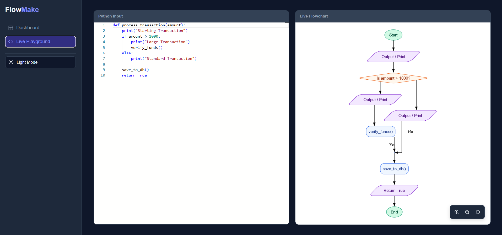

# FlowMake - Python to Flowchart Visualizer

FlowMake is a modern full-stack application that automatically converts Python source code into professional, orthogonal flowcharts. It features a file-based dashboard for organizing projects and a live playground for real-time visualization.



## 🚀 Features

### 🌟 Core Experience
* **Live Playground:** Type Python code on the left and see the flowchart generate instantly on the right.
* **Interactive Canvas:** **Zoom, Pan, and Drag** complex flowcharts just like a map to inspect logic details.
* **Smart Dashboard:** Drag & drop `.py` files to auto-generate flowcharts for every function and class.
* **Folder Organization:** Automatically groups methods into folders based on their Class structure.
* **Dark Mode:** Built-in dark theme toggle for late-night coding sessions 🌙.

### 🎨 Visuals & Parsing
* **AST Analysis:** Uses Python's Abstract Syntax Tree to accurately map code flow.
* **Semantic Coloring:**
    * 🟢 **Green:** Start / End
    * 🔵 **Blue:** Processing / Logic
    * 🟣 **Purple:** I/O (Prints, Returns)
    * 🟠 **Orange:** Decisions (If/Else)

---

## 🛠️ Tech Stack

* **Frontend:** React (Vite), Monaco Editor, Lucide Icons
* **Visualization:** `react-zoom-pan-pinch` (Canvas interactions)
* **Backend:** Python, FastAPI, Graphviz
* **Analysis:** Python `ast` (Abstract Syntax Tree)

---

## 📦 How to Run

Since this project relies on system-level graphics rendering, you must install **Graphviz** on your computer first.

### 1. Install Prerequisites
* **Windows:** [Download Graphviz Installer](https://graphviz.org/download/) (Select **"Add Graphviz to system PATH"** during install).
* **Mac:** `brew install graphviz`
* **Linux:** `sudo apt-get install graphviz`

### 2. Backend Setup
Navigate to the `backend` folder:

```bash
cd backend

# Create virtual environment (Optional but recommended)
python -m venv venv
# Windows: venv\Scripts\activate
# Mac/Linux: source venv/bin/activate

# Install dependencies
pip install -r requirements.txt

# Run the Server
uvicorn main:app --reload --host 127.0.0.1 --port 8000
```

---

## 🌐 Deployment

### Frontend on Vercel
The frontend is configured to use a deploy-time API base URL. Set this environment variable in Vercel:

```bash
VITE_API_BASE_URL=https://your-render-backend.onrender.com
```

Deploy the `frontend` folder as the Vercel project root. The included `vercel.json` handles client-side routing.

### Backend on Render
The backend is set up to run as a Docker web service on Render.

Required setup:

- Use the `backend` folder as the Render root directory.
- Build from the included [Dockerfile](backend/Dockerfile).
- Set `CORS_ORIGINS` to your Vercel app URL:

```bash
CORS_ORIGINS=https://your-vercel-app.vercel.app
```

Why Docker is needed:

- The app generates PNG flowcharts with Graphviz.
- Render needs the Graphviz system package installed for that rendering step.
- The provided Dockerfile installs Graphviz before starting FastAPI.

### Recommended flow

1. Deploy the backend to Render first.
2. Copy the Render service URL into `VITE_API_BASE_URL` on Vercel.
3. Deploy the frontend to Vercel.
4. Update `CORS_ORIGINS` on Render if your Vercel domain changes.

### Local environment variables

For local frontend development, you can create `frontend/.env` with:

```bash
VITE_API_BASE_URL=http://127.0.0.1:8000
```

For local backend development, no extra env vars are required unless you want to restrict CORS.